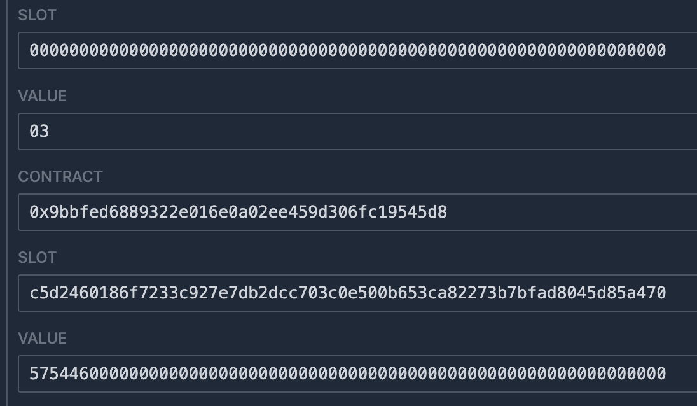

# WTF Huff极简入门: 12. String

我最近在重新学Huff，巩固一下细节，也写一个“Huff极简入门”，供小白们使用（编程大佬可以另找教程），每周更新1-3讲。

推特：[@0xAA_Science](https://twitter.com/0xAA_Science)

社区：[Discord](https://discord.gg/5akcruXrsk)｜[微信群](https://docs.google.com/forms/d/e/1FAIpQLSe4KGT8Sh6sJ7hedQRuIYirOoZK_85miz3dw7vA1-YjodgJ-A/viewform?usp=sf_link)｜[官网 wtf.academy](https://wtf.academy)

所有代码和教程开源在github: [github.com/AmazingAng/WTF-Huff](https://github.com/AmazingAng/WTF-Huff)

-----

Huff并不原生支持字符串（string），这一讲，我们介绍如何在Huff中使用String，包括将`string`保存到状态变量和在函数中返回它。

## String

在Solidity合约中，我们经常会用到字符串类型的变量，比如ERC20标准中的`symbol`和`name`都是字符串。Huff并不原生支持`string`类型，但是我们可以根据Solidity的存储布局和ABI标准，在Huff中实现它。

要实现的Solidity合约：

```solidity
// SPDX-License-Identifier: MIT
pragma solidity ^0.8.15;

contract String {
    string str;

    function setString(string memory _str) external{
        str = _str;
    }

    function getString() external view returns(string memory _str){
        _str = str;
    }
}
```

## string类型进阶

要在Huff中实现`string`类型，我们必须先学习它是如何在EVM的存储、`calldata`，和`returndata`中布局的。

### 存储布局

在Solidity中，`string`是以动态数组的方式存储的。假设我们开始从存储槽`0`开始存储一个`string`类型的数据`str`。那么slot 0其实不直接存储字符串的内容，而是存储字符串的字节长度，比如字符串`WTF`长度为`3`字节，slot 0中存储的是`3`。

那么字符串的实际内容存在哪个存储槽呢？这个存储槽由slot `0`的`keccak256`哈希值决定，也就是存储槽`keccak256(0)`。如果字符串的长度超过`32`个字节，那么接下来的内容将存储在`keccak256(0) + 1`、`keccak256(0) + 2`等位置。

### calldata布局

在Solidity中，当你通过外部函数传递string类型的变量时，它会使用calldata进行编码。calldata是一个非变动、只读的存储空间，用于函数参数。对于动态类型如string，calldata编码规则如下：

1. 函数选择器: `calldata`的前4个字节（`0x00`到`0x03`）一般是函数选择器。比如`7fcaf666`。

2. 偏移量: 接下来，`calldata`不直接开始存储字符串内容。它首先存储一个偏移量，该偏移量表示字符串数据开始的位置（相对于`calldata`的开始位置）。对于一个单一的`string`参数，这个偏移量通常是`0x24`（4 + 32字节），因为前4字节用于函数选择器，后32字节用于表示这个偏移量自己（`0x04`到`0x23`）。比如`0000000000000000000000000000000000000000000000000000000000000024`

3. 字符串长度: 在偏移量之后，即在`calldata`的`0x24`位置，会存储字符串的长度，占`32`字节（`0x24`到`0x43`）。比如`WTF`的长度为`3`字节，则这一段为`0000000000000000000000000000000000000000000000000000000000000003`

4. 字符串内容: 在字符串长度后，我们会看到实际的字符串内容。字符串会以`UTF-8`编码（字符的`ASCII`值）的方式存储，例如`WTF`的`UTF-8`编码为`575446`。请注意，每个`calldata`槽位都有`32`字节，所以即使字符串很短，它也会被右填充到`32`字节。对于一个短字符串来说，它会占32字节（`0x44`到`0x63`）。比如`WTF`会编码为`5754460000000000000000000000000000000000000000000000000000000000`

因此，如果我们调用的函数选择器为`7fcaf666`且字符串为`WTF`，那么`calldata`为：

```
7fcaf666000000000000000000000000000000000000000000000000000000000000002400000000000000000000000000000000000000000000000000000000000000035754460000000000000000000000000000000000000000000000000000000000
```

### returndata布局

`returndata`的布局与`calldata`类似，不同的是没有了前`4`字节的函数选择器。如果我们返回的是字符串为`WTF`，那么`returndata`为：

```
000000000000000000000000000000000000000000000000000000000000002000000000000000000000000000000000000000000000000000000000000000035754460000000000000000000000000000000000000000000000000000000000
```

## 在Huff中实现string类型

### setString

下面我们来用Huff实现`setString()`函数，为了简单，我们只考虑短字符串（长度小于`32`字节）。它的逻辑就是：

- 从`calldata`中读取字符串长度，偏移量为`0x24`。
- 从`calldata`中读取字符串内容，偏移量为`0x44`。

```c
/* 接口 */
#define function setString(string memory str_) nonpayable
#define function getString() view returns (string memory)

/* 方法 */
#define macro SET_STRING() = takes (0) returns (0) {
    0x24 calldataload   // [len]
    0x00 sstore    // [] storage: [0x00: len]

    0x44 calldataload   // [str]
    0x00 sha3 sstore // [] storage: [0x00: len, sha3(0): str]
    stop
}
```

下面我们实现`getString()`函数，它的逻辑就是从存储中读取值，在内存中拼接好，最后通过`return`返回。

```c
#define macro GET_STRING() = takes (0) returns (0) {
    0x20 0x00 mstore    // [] memory: [0x00: 0x20]

    0x00 sload          // [len] memory: [0x00: 0x20]
    0x20 mstore         // [] memory: [0x00: 0x20, 0x20: len]

    0x00 sha3 sload     // [str] memory: [0x00: 0x20, 0x20: len]
    0x40 mstore         // [] memory: [0x00: 0x20, 0x20: len, 0x40: str]   

    0x60 0x00 return
}
```

最后，我们在MAIN宏中通过selector判断要调用哪个函数。

```c
#define macro MAIN() = takes (0) returns (0) {
    // 通过selector判断要调用哪个函数
    0x00 calldataload 0xE0 shr
    dup1 __FUNC_SIG(setString) eq set_string jumpi
    dup1 __FUNC_SIG(getString) eq get_string jumpi
    // 如果没有匹配的函数，就revert
    0x00 0x00 revert

    set_string:
        SET_STRING()
    get_string:
        GET_STRING()    
}
```

## 分析合约字节码

我们可以使用`huffc`命令获取上面合约的runtime code:

```shell
huffc src/12_String.huff -r
```

打印出的bytecode为：

```
5f3560e01c80637fcaf6661461001e57806389ea642f1461002c575f5ffd5b6024355f556044355f5f2055005b60205f525f546020525f5f205460405260605ff3
```

将这段字节码复制到[evm.codes playground](https://www.evm.codes/playground?fork=shanghai)。首先，我们调用`setString()`函数。将`Calldata`设为`0x7fcaf666000000000000000000000000000000000000000000000000000000000000002400000000000000000000000000000000000000000000000000000000000000035754460000000000000000000000000000000000000000000000000000000000`（调用`setString`函数，参数字符串类型的`"WTF"`）并点击运行。右下角的`Storage`被相应更改，运行成功。



接下来，我们调用`getString()`函数，读取存储中字符串的值。将`Calldata`设为`0x89ea642f`，并运行。可以看到，右下角的`RETURN VALUE`为`000000000000000000000000000000000000000000000000000000000000002000000000000000000000000000000000000000000000000000000000000000035754460000000000000000000000000000000000000000000000000000000000`，与预期一致，运行成功。


## 总结

这一讲，我们介绍了如何在Huff中写入并读取`string`类型，并在`evm.codes`上成功运行了合约。