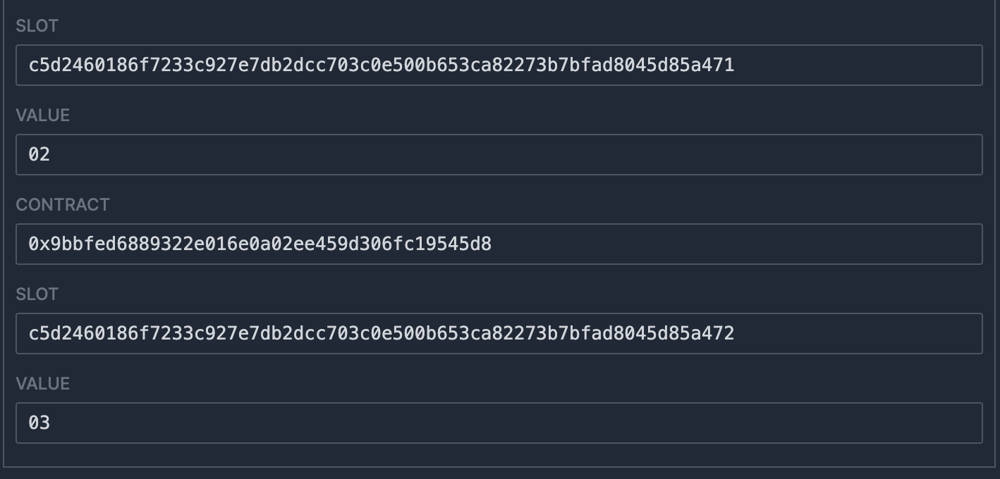

# WTF Huff极简入门: 13. 数组

我最近在重新学Huff，巩固一下细节，也写一个“Huff极简入门”，供小白们使用（编程大佬可以另找教程），每周更新1-3讲。

推特：[@0xAA_Science](https://twitter.com/0xAA_Science)

社区：[Discord](https://discord.gg/5akcruXrsk)｜[微信群](https://docs.google.com/forms/d/e/1FAIpQLSe4KGT8Sh6sJ7hedQRuIYirOoZK_85miz3dw7vA1-YjodgJ-A/viewform?usp=sf_link)｜[官网 wtf.academy](https://wtf.academy)

所有代码和教程开源在github: [github.com/AmazingAng/WTF-Huff](https://github.com/AmazingAng/WTF-Huff)

-----

Huff并不原生支持数组（`array`）类型，这一讲，我们介绍如何在Huff中使用可变数组（dynamic array），包括将其保存到状态变量和在函数中返回。

## 数组

在Solidity合约中，我们经常会用到数组变量。Huff并不原生支持数组类型，但是我们可以根据Solidity的存储布局和ABI标准，在Huff中实现它。

要实现的Solidity合约：

```solidity
// SPDX-License-Identifier: MIT
pragma solidity ^0.8.15;

contract Array {
    uint[] arr;

    function setArray(uint[] memory _arr) external{
        arr = _arr;
    }

    function getArray() external view returns(uint[] memory _arr){
        _arr = arr;
    }
}
```

## array类型进阶

在这一讲，我们只介绍`uint256[]`类型（也可以写为`uint[]`），它是成员为`uint256`类型的动态数组。要在Huff中实现``uint256[]`类型，我们必须先学习它是如何在EVM的存储、`calldata`，和`returndata`中布局的。

### 存储布局

假设我们开始从存储槽`0`开始存储一个`uint[]`类型的数据`arr`。那么slot 0其实不直接存储数组的成员，而是存储数组的长度，比如数组`[1, 2, 3]`长度为`3`，slot 0中存储的是`3`。

那么数组成员的值存在哪个存储槽呢？这个存储槽由slot `0`的`keccak256`哈希值决定，也就是存储槽`keccak256(0)`，数组的第一个成员就存在这里。而接下来的成员将存储在`keccak256(0) + 1`、`keccak256(0) + 2`等位置。

### calldata布局

在Solidity中，当你通过外部函数传递`uint[]`类型的变量时，它会使用calldata进行编码。对于`uint[]`，calldata编码规则如下：

1. 函数选择器: `calldata`的前4个字节（`0x00`到`0x03`）一般是函数选择器。比如`08d71642`。

2. 偏移量: 接下来，`calldata`不直接开始存储数组成员。它首先存储一个偏移量，该偏移量表示数组数据开始的位置。对于一个单一的`uint[]`参数，这个偏移量通常是`0x20`（32字节），因为前32字节用于表示这个偏移量自己（`0x04`到`0x23`）。比如`0000000000000000000000000000000000000000000000000000000000000020`

3. 数组长度: 在偏移量之后，即在`calldata`的`0x24`位置，会存储数组的长度，占`32`字节（`0x24`到`0x43`）。比如数组`[1, 2, 3]`的长度为`3`，则这一段为`0000000000000000000000000000000000000000000000000000000000000003`

4. 数组成员: 在数组长度后，我们会看到数组成员的值，每个成员占`32`字节。对于数组`[1, 2, 3]`来说，它会占`96`字节（32*3），会编码为`000000000000000000000000000000000000000000000000000000000000000100000000000000000000000000000000000000000000000000000000000000020000000000000000000000000000000000000000000000000000000000000003`

因此，如果我们调用的函数选择器为`08d71642`且数组为`[1, 2, 3]`，那么`calldata`为：

```
08d7164200000000000000000000000000000000000000000000000000000000000000200000000000000000000000000000000000000000000000000000000000000003000000000000000000000000000000000000000000000000000000000000000100000000000000000000000000000000000000000000000000000000000000020000000000000000000000000000000000000000000000000000000000000003
```

### returndata布局

`returndata`的布局与`calldata`类似，不同的是没有了前`4`字节的函数选择器。如果我们返回的数组为`[1, 2, 3]`，那么`returndata`为：

```
00000000000000000000000000000000000000000000000000000000000000200000000000000000000000000000000000000000000000000000000000000003000000000000000000000000000000000000000000000000000000000000000100000000000000000000000000000000000000000000000000000000000000020000000000000000000000000000000000000000000000000000000000000003
```

## 在Huff中实现uint[]类型

### setArray

下面我们来用Huff实现`setArray()`函数，将`uint[]`参数存入状态变量中。它的逻辑就是：

- 从`calldata`中读取数组长度，偏移量为`0x24`。
- 通过循环，从`calldata`中依次读取数组成员，并使用`sstore`保存到相应的slot。

```c
/* 接口 */
#define function setArray(uint256[] memory arr) nonpayable returns ()
#define function getArray() view returns (uint256[] memory)

/* 方法 */
#define macro SET_ARRAY() = takes (0) returns (0) {
    // 假设我们将array保存在slot 0中
    0x24 calldataload   // [len]
    dup1                // [len, len]
    // 将 len 保存到 slot 0x00
    0x00 sstore         // [len] storage: [0x00: len]
    0x00 0x00 sha3           // [sha3(0), len] storage: [0x00: len]
    0x00                // [index(0), sha3(0), len] storage: [0x00: len]
    
    // 循环
    loop: 
        // 比较index和len是否相等，如果相等，则跳转到end
        dup3 dup2 eq end jumpi // [index(i), sha3(0), len] storage: [0x00: len]
        // 从calldata中读取array(i)
        dup1 0x20 mul 0x44 add calldataload // [array(i), index(i), sha3(0), len] storage: [0x00: len]
        // 保存到slot sha3(0)+i
        dup3 dup3 add sstore        // [index(i), sha3(0), len] storage: [0x00: len, sha3(0)+i: array(i)]
        // 更新i
        0x01 add                    // [index(i+1), sha3(0), len] storage: [0x00: len, sha3(0)+i: array(i)]
        // 继续循环
        loop jump

    // 循环结束，返回
    end:
        stop
}
```

下面我们实现`getArray()`函数，它的逻辑就是通过循环从存储中读取数组的值，在内存中拼接好，最后通过`return`返回。

```c
#define macro GET_ARRAY() = takes (0) returns (0) {
    // 假设我们将array保存在slot 0中
    // 将offset 0x20保存到memory
    0x20 0x00 mstore    // [] memory: [0x00: 0x20]
    // 从slot 0读取数组长度
    0x00 sload dup1     // [len, len] memory: [0x00: 0x20]
    // 将数组长度保存到memory
    0x20 mstore         // [len] memory: [0x00: 0x20, 0x20: len]
    // 计算sha3(0)
    0x00 0x00 sha3      // [sha3(0), len] memory: [0x00: 0x20, 0x20: len]
    0x00                // [index(0), sha3(0), len] memory: [0x00: 0x20, 0x20: len]
    
    // 循环
    loop: 
        // 比较index和len是否相等，如果相等，则跳转到end
        dup3 dup2 eq end jumpi  // [index(i), sha3(0), len] memory: [0x00: 0x20, 0x20: len]
        // 从storage中读取array(i): slot sha3(0)+i
        dup2 dup2 add sload     // [array(i), index(i), sha3(0), len] memory: [0x00: 0x20, 0x20: len]
        // 保存到memory
        dup2 0x20 mul 0x40 add mstore // [index(i), sha3(0), len] memory: [0x00: 0x20, 0x20: len, 0x40+0x20*i: array(i)]
        // 更新i
        0x01 add                // [index(i+1), sha3(0), len] memory: [0x00: 0x20, 0x20: len, 0x40+0x20*i: array(i)]
        // 继续循环
        loop jump

    // 循环结束，返回
    end:
        // 返回returndata
        0x20 mul 0x40 add 0x00 return
}
```

最后，我们在MAIN宏中通过selector判断要调用哪个函数。

```c
#define macro MAIN() = takes (0) returns (0) {
    // 通过selector判断要调用哪个函数
    0x00 calldataload 0xE0 shr
    dup1 __FUNC_SIG(setArray) eq set_array jumpi
    dup1 __FUNC_SIG(getArray) eq get_array jumpi

    // 如果没有匹配的函数，就revert
    0x00 0x00 revert

    set_array:
        SET_ARRAY()
    get_array:
        GET_ARRAY()
}
```

## 分析合约字节码

我们可以使用`huffc`命令获取上面合约的runtime code:

```shell
huffc src/13_Array.huff -r
```

打印出的bytecode为：

```
5f3560e01c806308d716421461001e578063d504ea1d14610046575f5ffd5b602435805f555f5f205f5b82811461004457806020026044013582820155600101610029565b005b60205f525f54806020525f5f205f5b82811461007057818101548160200260400152600101610055565b6020026040015ff3
```

将这段字节码复制到[evm.codes playground](https://www.evm.codes/playground?fork=shanghai)。首先，我们调用`setArray()`函数。将`Calldata`设为`0x08d7164200000000000000000000000000000000000000000000000000000000000000200000000000000000000000000000000000000000000000000000000000000003000000000000000000000000000000000000000000000000000000000000000100000000000000000000000000000000000000000000000000000000000000020000000000000000000000000000000000000000000000000000000000000003`（调用`setArray`函数，参数为`uint[]`类型的`"[1,2,3]"`）并点击运行。右下角的`Storage`被相应更改，运行成功。



接下来，我们调用`getArray()`函数，读取并返回状态变量中数组的值。将`Calldata`设为`d504ea1d`，并运行。可以看到，右下角的`RETURN VALUE`为`00000000000000000000000000000000000000000000000000000000000000200000000000000000000000000000000000000000000000000000000000000003000000000000000000000000000000000000000000000000000000000000000100000000000000000000000000000000000000000000000000000000000000020000000000000000000000000000000000000000000000000000000000000003`，与预期一致，运行成功。


## 使用Foundry测试

我们可以使用Foundry写一个测试，用Solidity来验证咱们写的Huff合约是否真的能保存和返回Solidity的`uint[]`类型变量。

测试合约：

```solidity
// SPDX-License-Identifier: Unlicense
pragma solidity ^0.8.15;

import "foundry-huff/HuffDeployer.sol";
import "forge-std/Test.sol";
import "forge-std/console.sol";

contract ArrayTest is Test {
    /// @dev Address of the I13_Array contract.
    I13_Array public i13_Array;

    /// @dev Setup the testing environment.
    function setUp() public {
        i13_Array = I13_Array(HuffDeployer.deploy("13_Array"));
    }

    /// @dev Ensure that you can set and get the value.
    function testSetAndGetArray() public {
        uint[] memory arr_ = new uint[](3);
        arr_[0] = 1;
        arr_[1] = 2;
        arr_[2] = 3;
        i13_Array.setArray(arr_);
        assertEq(arr_, i13_Array.getArray());
    }
}

interface I13_Array {
	function getArray() external view returns (uint256[] memory);
	function setArray(uint256[] memory) external;
}
```

在命令行输入中输入`forge test`运行测试合约，可以看到测试通过！


## 总结

这一讲，我们介绍了如何在Huff中写入并读取`uint[]`类型的动态数组，并在`evm.codes`上成功运行了合约。