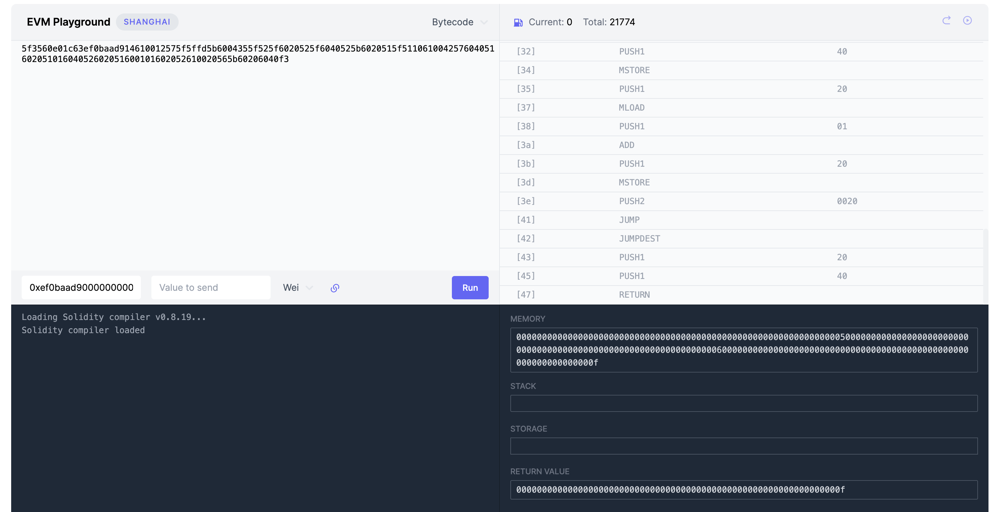

title: 11. Loop
tags:
   -huff
   -interface
   - loop
   - bytecode
---

# WTF Huff Minimalist Introduction: 11. Loops

I'm re-learning Huff recently, consolidating the details, and writing a "Minimalist Introduction to Huff" for novices (programming experts can find another tutorial). I will update 1-3 lectures every week.

Twitter: [@0xAA_Science](https://twitter.com/0xAA_Science)

Community: [Discord](https://discord.gg/5akcruXrsk)｜[WeChat Group](https://docs.google.com/forms/d/e/1FAIpQLSe4KGT8Sh6sJ7hedQRuIYirOoZK_85miz3dw7vA1-YjodgJ-A/viewform?usp=sf_link) |[Official website wtf.academy](https://wtf.academy)

All codes and tutorials are open source on github: [github.com/AmazingAng/WTF-Huff](https://github.com/AmazingAng/WTF-Huff)

-----

Huff does not natively support loops. In this lecture, we introduce how to use a set of jump labels to implement loops in Huff.

## Loop

Huff does not natively support looping, but we can implement looping through a set of jump tags. In this lecture, we will use Huff to implement the `sumTo()` function written in Solidity:

```solidity
function sumTo(uint256 n) public pure returns(uint256){
        uint sum = 0;
        for(uint i = 0; i <= n; i++){
            sum += i;
        }
        return(sum);
    }
```

## Use Huff to implement looping

The implementation logic is very simple. We first define a jump label `loop` at the beginning of the loop, and another jump label `end` at the end of the loop. We judge whether the loop condition is still true at the beginning of each loop body. If it is true, we run the loop body, update `i`, and jump to `loop` for the next loop; if not, jump to `end`, End the cycle.

Below, the code for using a loop to implement the `sumTo()` function in Huff:

```c
/* interface */
#define function sumTo(uint256) nonpayable returns (uint256)

/* method */
#define macro SUM_TO() = takes (0) returns (0) {
    0x04 calldataload   // [n]
    0x00 mstore         // [] memory: [0x00: n]
    0x00 0x20 mstore    // [] memory: [0x00: n, 0x20: i]
    0x00 0x40 mstore    // [] memory: [0x00: n, 0x20: i, 0x40: sum]

// loop
     loop:
         // Load i and n, compare i > n
         0x20 mload 0x00 mload lt // [i>n]
         //If greater than, end the loop
         end jumpi // []

         // Execute the loop body and increase the value of sum
         0x40 mload // [sum]
         0x20 mload // [i, sum]
         add // [sum+i]
         0x40 mstore // []

         //increment i
         0x20 mload // [i]
         0x01 add // [i+1]
         0x20 mstore // []

         // continue looping
         loop jump

     //End of loop, return result
     end:
         // return value
         0x64 0x00 return
}


#define macro MAIN() = takes (0) returns (0) {
     // Determine which function to call through selector
     0x00 calldataload 0xE0 shr
     __FUNC_SIG(sumTo) eq sum jumpi
     // If there is no matching function, revert
     0x00 0x00 revert

     sum:
         SUM_TO()
}
```

## Analyze contract bytecode

We can use the `huffc` command to obtain the runtime code of the above contract:

```shell
huffc src/11_Loop.huff -r
```

The printed bytecode is:

```
5f3560e01c63ef0baad914610012575f5ffd5b6004355f525f6020525f6040525b6020515f51106100425760405160205101604052602051600101602052610020565b60206040f3
```

Copy this bytecode to [evm.codes playground](https://www.evm.codes/playground?fork=shanghai), set `Calldata` to `0xef0baad90000000000000000000000000000000000000000000000000000000000000000005` (call `sumTo `function,parameter` n` is set to `5`) and click Run. The return value in the lower right corner is `0x00...0f`, which is `15` (`=1+2+3+4+5`). The contract runs successfully!



## Summary

In this lecture, we introduced how to use loops in Huff and successfully ran the contract on `evm.codes`.
