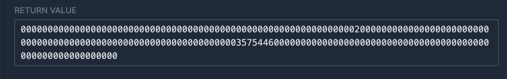
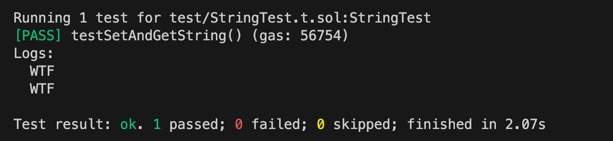

# WTF Huff Minimalist Introduction: 12. String

I'm re-learning Huff recently, consolidating the details, and writing a "Minimalist Introduction to Huff" for novices (programming experts can find another tutorial). I will update 1-3 lectures every week.

Twitter: [@0xAA_Science](https://twitter.com/0xAA_Science)

Community: [Discord](https://discord.gg/5akcruXrsk)｜[WeChat Group](https://docs.google.com/forms/d/e/1FAIpQLSe4KGT8Sh6sJ7hedQRuIYirOoZK_85miz3dw7vA1-YjodgJ-A/viewform?usp=sf_link) |[Official website wtf.academy](https://wtf.academy)

All codes and tutorials are open source on github: [github.com/AmazingAng/WTF-Huff](https://github.com/AmazingAng/WTF-Huff)

-----

Huff does not natively support strings. In this lecture, we introduce how to use String in Huff, including saving `string` to a state variable and returning it in a function.

## String

In Solidity contracts, we often use string-type variables. For example, `symbol` and `name` in the ERC20 standard are both strings. Huff does not natively support the `string` type, but we can implement it in Huff according to Solidity's storage layout and ABI standards.

Solidity contract to be implemented:

```solidity
// SPDX-License-Identifier: MIT
pragma solidity ^0.8.15;

contract String {
    string str;

    function setString(string memory _str) external{
        str = _str;
    }

    function getString() external view returns(string memory _str){
        _str = str;
    }
}
```

## String type advanced

To implement the `string` type in Huff, we must first learn how it is laid out in the EVM's storage, `calldata`, and `returndata`.

### Storage layout

In Solidity, `string` and `bytes` are stored in the same way.

- For short bytes/strings (length <=`31` bytes), the content and length of the string will be stored in the same slot, just like `bytes32` or `uint256`, thus saving gas. The contents of the string are stored starting with the highest-order byte, and twice the length of the string (`len * 2`) is stored in the lowest-order byte. For example, the length of `WTF` is `3`, and its `ASCII` value is `575446`, which is represented in the storage slot as `575446000000000000000000000000000000000000000000000000000000006`.

- For long bytes/strings (length > `31` bytes), storage is the same as dynamic arrays. Suppose we start storing long strings from storage slot `0`, then `slot 0` only stores the `length * 2 + 1` of the string, which is for convenience and short string distinction. So which storage slot does the actual content of the string live in? This storage slot is determined by the `keccak256` hash value of slot `0`, which is the storage slot `keccak256(0)`. If one storage slot is not enough, the next content will be stored in `keccak256(0) + 1`, `keccak256(0) + 2` and other positions.

For more information about storage layout, please refer to [Solidity Documentation](https://docs.soliditylang.org/zh/v0.8.20/internals/layout_in_storage.html)。

### calldata layout

In Solidity, when you pass a variable of type string through an external function, it is encoded using calldata. calldata is an immutable, read-only storage space for function parameters. For dynamic types such as string, the calldata encoding rules are as follows:

1. Function selector: The first 4 bytes of `calldata` (`0x00` to `0x03`) are generally function selectors. For example `7fcaf666`.

2. Offset: Next, `calldata` does not directly start storing the string content. It first stores an offset that represents where the string data begins. For a single `string` parameter, this offset is usually `0x20` (32 bytes), since the first 32 bytes are used to represent the offset itself (`0x04` to `0x23`). For example `0000000000000000000000000000000000000000000000000000000000000020`

3. String length: After the offset, that is, at the `0x24` position of `calldata`, the length of the string will be stored, accounting for `32` bytes (`0x24` to `0x43`). For example, the length of `WTF` is `3` bytes, then this section is `0000000000000000000000000000000000000000000000000000000000000003`

4. String content: After the string length, we will see the actual string content. The string will be stored in `UTF-8` encoding (the `ASCII` value of the character), for example, the `UTF-8` encoding of `WTF` is `575446`. Note that each calldata slot has 32 bytes, so even if the string is short, it will be right padded to 32 bytes. For a short string, it will occupy 32 bytes (`0x44` to `0x63`). For example, `WTF` would be encoded as `575446000000000000000000000000000000000000000000000000000000000`

So, if we call the function selector 7fcaf666 and the string is WTF, then the calldata is:

```
7fcaf666000000000000000000000000000000000000000000000000000000000000002000000000000000000000000000000000000000000000000000000000000000035754460000000000000000000000000000000000000000000000000000000000
```

### returndata layout

The layout of `returndata` is similar to `calldata`, except that there is no function selector in the first `4` bytes. If we return a string as `WTF`, then `returndata` is:

```
000000000000000000000000000000000000000000000000000000000000002000000000000000000000000000000000000000000000000000000000000000035754460000000000000000000000000000000000000000000000000000000000
```

## Implement string type in Huff

### setString

Next we use Huff to implement the `setString()` function. For simplicity, we only consider short strings (length less than `32` bytes). Its logic is:

- Read the string length from `calldata` at offset `0x24`.
- Read the string content from `calldata` at offset `0x44`.

```c
/* interface */
#define function setString(string memory str_) nonpayable
#define function getString() view returns (string memory)

/* method */
#define macro SET_STRING() = takes (0) returns (0) {
    0x24 calldataload   // [len]
    0x00 sstore    // [] storage: [0x00: len]

    0x44 calldataload   // [str]
    0x00 sha3 sstore // [] storage: [0x00: len, sha3(0): str]
    stop
}
```

Next we implement the `getString()` function. Its logic is to read the value from the storage, splice it in the memory, and finally return it through `return`.

```c
#define macro GET_STRING() = takes (0) returns (0) {
    0x20 0x00 mstore    // [] memory: [0x00: 0x20]

    0x00 sload          // [len] memory: [0x00: 0x20]
    0x20 mstore         // [] memory: [0x00: 0x20, 0x20: len]

    0x00 sha3 sload     // [str] memory: [0x00: 0x20, 0x20: len]
    0x40 mstore         // [] memory: [0x00: 0x20, 0x20: len, 0x40: str]   

    0x60 0x00 return
}
```

Finally, we use the selector in the MAIN macro to determine which function to call.

```c
#define macro MAIN() = takes (0) returns (0) {
    // Determine which function to call through selector
    0x00 calldataload 0xE0 shr
    dup1 __FUNC_SIG(setString) eq set_string jumpi
    dup1 __FUNC_SIG(getString) eq get_string jumpi
    // If there is no matching function, revert
    0x00 0x00 revert

    set_string:
        SET_STRING()
    get_string:
        GET_STRING()    
}
```

## Analyze contract bytecode

We can use the `huffc` command to obtain the runtime code of the above contract:

```shell
huffc src/12_String.huff -r
```

The printed bytecode is:

```
5f3560e01c80637fcaf6661461001e57806389ea642f1461002c575f5ffd5b602435600202604435015f55005b60205f525f548060ff1660011c60205260ff191660405260605ff3
```

Copy this bytecode to [evm.codes playground](https://www.evm.codes/playground?fork=shanghai). First, we call the `setString()` function. Set `Calldata` to `0x7fcaf6660000000000000000000000000000000000000000000000000000000000024000000000000000000000000000000000 000000000000000000000000357544600000000000000000000000000000000000000000000000000000000000` (call the `setString` function, the parameter is the string type `"WTF"`) and click Run. The `Storage` in the lower right corner was changed accordingly and the operation was successful.


Next, we call the `getString()` function to read the value of the stored string. Set `Calldata` to `0x89ea642f` and run. As you can see, the `RETURN VALUE` in the lower right corner is `0000000000000000000000000000000000000000000000000000000000000000000000000 000000000000000000000003575446000000000000000000000000000000000000000000000000000000000`, as expected, the operation was successful.



## Test using Foundry

We can use Foundry to write a test and use Solidity to verify whether the Huff contract we wrote can really save and return Solidity's string type variable.

Test contract:

```solidity
// SPDX-License-Identifier: Unlicense
pragma solidity ^0.8.15;

import "foundry-huff/HuffDeployer.sol";
import "forge-std/Test.sol";
import "forge-std/console.sol";

contract StringTest is Test {
    /// @dev Address of the I12_String contract.
    I12_String public i12_String;

    /// @dev Setup the testing environment.
    function setUp() public {
        i12_String = I12_String(HuffDeployer.deploy("12_String"));
    }

    /// @dev Ensure that you can set and get the value.
    function testSetAndGetString() public {
        string memory str_ = "WTF";
        i12_String.setString(str_);
        string memory str_get = i12_String.getString();
        console.log(str_get);
        console.log(str_);
        assertEq(str_, i12_String.getString());
    }
}

interface I12_String {
	function getString() external view returns (string memory);
	function setString(string memory) external;
}
```

Enter `forge test` in the command line input to run the test contract, and you can see that the test passes!



## Summary

In this lecture, we introduced how to write and read the `string` type in Huff, and successfully run the contract on `evm.codes`.
