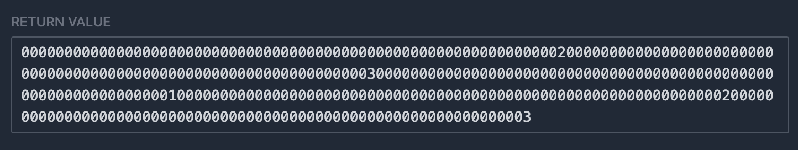
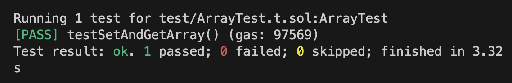

# WTF Huff Minimalist Introduction: 13. Arrays

I'm re-learning Huff recently, consolidating the details, and writing a "Minimalist Introduction to Huff" for novices (programming experts can find another tutorial). I will update 1-3 lectures every week.

Twitter: [@0xAA_Science](https://twitter.com/0xAA_Science)

Community: [Discord](https://discord.gg/5akcruXrsk)｜[WeChat Group](https://docs.google.com/forms/d/e/1FAIpQLSe4KGT8Sh6sJ7hedQRuIYirOoZK_85miz3dw7vA1-YjodgJ-A/viewform?usp=sf_link) |[Official website wtf.academy](https://wtf.academy)

All codes and tutorials are open source on github: [github.com/AmazingAng/WTF-Huff](https://github.com/AmazingAng/WTF-Huff)

-----

Huff does not natively support the array (`array`) type. In this lecture, we introduce how to use a variable array (dynamic array) in Huff, including saving it to a state variable and returning it in a function.

## Array

In Solidity contracts, we often use array variables. Huff does not natively support array types, but we can implement it in Huff according to Solidity's storage layout and ABI standards.

Solidity contract to be implemented:

```solidity
// SPDX-License-Identifier: MIT
pragma solidity ^0.8.15;

contract Array {
    uint[] arr;

    function setArray(uint[] memory _arr) external{
        arr = _arr;
    }

    function getArray() external view returns(uint[] memory _arr){
        _arr = arr;
    }
}
```

## Array type advanced

In this lecture, we only introduce the `uint256[]` type (can also be written as `uint[]`), which is a dynamic array with members of the `uint256` type. To implement the uint256[] type in Huff, we must first learn how it is laid out in the EVM's storage, calldata, and returndata.

### Storage layout

Suppose we start storing a `uint[]` type data `arr` starting from storage slot `0`. Then slot 0 does not directly store the members of the array, but stores the length of the array. For example, the length of the array `[1, 2, 3]` is `3`, and slot 0 stores `3`.

So which storage slot does the value of the array member store? This storage slot is determined by the `keccak256` hash value of slot `0`, which is the storage slot `keccak256(0)`, where the first member of the array is stored. The next members will be stored in `keccak256(0) + 1`, `keccak256(0) + 2`, etc.

### calldata layout

In Solidity, when you pass a variable of type `uint[]` through an external function, it is encoded using calldata. For `uint[]`, the calldata encoding rules are as follows:

1. Function selector: The first 4 bytes of `calldata` (`0x00` to `0x03`) are generally function selectors. For example `08d71642`.

2. Offset: Next, `calldata` does not directly start storing array members. It first stores an offset that represents where the array data begins. For a single `uint[]` parameter, this offset is usually `0x20` (32 bytes), since the first 32 bytes are used to represent the offset itself (`0x04` to `0x23`). For example `0000000000000000000000000000000000000000000000000000000000000020`

3. Array length: After the offset, that is, at the `0x24` position of `calldata`, the length of the array will be stored, accounting for `32` bytes (`0x24` to `0x43`). For example, if the length of the array `[1, 2, 3]` is `3`, then this section is `0000000000000000000000000000000000000000000000000000000000000003`

4. Array members: After the array length, we will see the value of the array members, each member occupies `32` bytes. For the array `[1, 2, 3]`, it will occupy `96` bytes (32*3) and will be encoded as `000000000000000000000000000000000000000000000000000000000000000100000000000000000000000000000000000000000000000000000000000000020000000000000000000000000000000000000000000000000000000000000003`

So, if the function we call has selector `08d71642` and the array is `[1, 2, 3]`, then `calldata` is:

```
08d7164200000000000000000000000000000000000000000000000000000000000000200000000000000000000000000000000000000000000000000000000000000003000000000000000000000000000000000000000000000000000000000000000100000000000000000000000000000000000000000000000000000000000000020000000000000000000000000000000000000000000000000000000000000003
```

### returndata layout

The layout of `returndata` is similar to `calldata`, except that there is no function selector in the first `4` bytes. If the array we return is `[1, 2, 3]`, then `returndata` is:

```
00000000000000000000000000000000000000000000000000000000000000200000000000000000000000000000000000000000000000000000000000000003000000000000000000000000000000000000000000000000000000000000000100000000000000000000000000000000000000000000000000000000000000020000000000000000000000000000000000000000000000000000000000000003
```

## Implement uint[] type in Huff

### setArray

Next, we use Huff to implement the `setArray()` function and store the `uint[]` parameters into the state variable. Its logic is:

- Read the array length from `calldata` at offset `0x24`.
- Through a loop, read the array members sequentially from `calldata` and save them to the corresponding slot using `sstore`.

```c
/* interface */
#define function setArray(uint256[] memory arr) nonpayable returns ()
#define function getArray() view returns (uint256[] memory)

/* method */
#define macro SET_ARRAY() = takes (0) returns (0) {
     // Assume we save the array in slot 0
     0x24 calldataload // [len]
     dup1 // [len, len]
     // Save len to slot 0x00
     0x00 sstore // [len] storage: [0x00: len]
     0x00 0x00 sha3 // [sha3(0), len] storage: [0x00: len]
     0x00 // [index(0), sha3(0), len] storage: [0x00: len]
    
 // loop
     loop:
         // Compare index and len to see if they are equal. If they are equal, jump to end.
         dup3 dup2 eq end jumpi // [index(i), sha3(0), len] storage: [0x00: len]
         //Read array(i) from calldata
         dup1 0x20 mul 0x44 add calldataload // [array(i), index(i), sha3(0), len] storage: [0x00: len]
         // Save to slot sha3(0)+i
         dup3 dup3 add sstore // [index(i), sha3(0), len] storage: [0x00: len, sha3(0)+i: array(i)]
         // update i
         0x01 add // [index(i+1), sha3(0), len] storage: [0x00: len, sha3(0)+i: array(i)]
         // continue looping
         loop jump

     //End of loop, return
     end:
         stop
}
```

Next we implement the `getArray()` function. Its logic is to read the value of the array from storage through a loop, splice it in memory, and finally return it through `return`.

```c
#define macro GET_ARRAY() = takes (0) returns (0) {
     // Assume we save the array in slot 0
     // Save offset 0x20 to memory
     0x20 0x00 mstore // [] memory: [0x00: 0x20]
     //Read the array length from slot 0
     0x00 sload dup1 // [len, len] memory: [0x00: 0x20]
     //Save the array length to memory
     0x20 mstore // [len] memory: [0x00: 0x20, 0x20: len]
     // Calculate sha3(0)
     0x00 0x00 sha3 // [sha3(0), len] memory: [0x00: 0x20, 0x20: len]
     0x00 // [index(0), sha3(0), len] memory: [0x00: 0x20, 0x20: len]
    
     // loop
    loop: 
       // Compare index and len to see if they are equal. If they are equal, jump to end.
         dup3 dup2 eq end jumpi // [index(i), sha3(0), len] memory: [0x00: 0x20, 0x20: len]
         //Read array(i) from storage: slot sha3(0)+i
         dup2 dup2 add sload // [array(i), index(i), sha3(0), len] memory: [0x00: 0x20, 0x20: len]
         // Save to memory
         dup2 0x20 mul 0x40 add mstore // [index(i), sha3(0), len] memory: [0x00: 0x20, 0x20: len, 0x40+0x20*i: array(i)]
         // update i
         0x01 add // [index(i+1), sha3(0), len] memory: [0x00: 0x20, 0x20: len, 0x40+0x20*i: array(i)]
         // continue looping
         loop jump

     //End of loop, return
     end:
         //return returndata
         0x20 mu 0x40 add 0x00 return
}
```

Finally, we use the selector in the MAIN macro to determine which function to call.

```c
#define macro MAIN() = takes (0) returns (0) {
    // Determine which function to call through selector
    0x00 calldataload 0xE0 shr
    dup1 __FUNC_SIG(setArray) eq set_array jumpi
    dup1 __FUNC_SIG(getArray) eq get_array jumpi

    // If there is no matching function, revert
    0x00 0x00 revert

    set_array:
        SET_ARRAY()
    get_array:
        GET_ARRAY()
}
```

## Analyze contract bytecode

We can use the `huffc` command to obtain the runtime code of the above contract:

```shell
huffc src/13_Array.huff -r
```

The printed bytecode is:

```
5f3560e01c806308d716421461001e578063d504ea1d14610046575f5ffd5b602435805f555f5f205f5b82811461004457806020026044013582820155600101610029565b005b60205f525f54806020525f5f205f5b82811461007057818101548160200260400152600101610055565b6020026040015ff3
```

Copy this bytecode to [evm.codes playground](https://www.evm.codes/playground?fork=shanghai). First, we call the `setArray()` function. Set `Calldata` to `0x08d71642000000000000000000000000000000000000000000000000000000000000000000000000000000000000000 000000000000000000000000030000000000000000000000000000000000000000000000000000000000000100000000000000 0000000000000000000000000000002000000000000000000000000000000000000000000000000000000003 "`) and click Run. The `Storage` in the lower right corner was changed accordingly and the operation was successful.


Next, we call the `getArray()` function to read and return the value of the array in the state variable. Set `Calldata` to `d504ea1d` and run. As you can see, the `RETURN VALUE` in the lower right corner is `0000000000000000000000000000000000000000000000000000002000000000000000000 000000000000000000000000300000000000000000000000000000000000000000000000000000000000000 0000000000000000000000000000200000000000000000000000000000000000000000000000000000000000003`, as expected, the operation was successful.



## Test using Foundry

We can use Foundry to write a test and use Solidity to verify whether the Huff contract we wrote can really save and return Solidity's `uint[]` type variable.

Test contract:

```solidity
// SPDX-License-Identifier: Unlicense
pragma solidity ^0.8.15;

import "foundry-huff/HuffDeployer.sol";
import "forge-std/Test.sol";
import "forge-std/console.sol";

contract ArrayTest is Test {
    /// @dev Address of the I13_Array contract.
    I13_Array public i13_Array;

    /// @dev Setup the testing environment.
    function setUp() public {
        i13_Array = I13_Array(HuffDeployer.deploy("13_Array"));
    }

    /// @dev Ensure that you can set and get the value.
    function testSetAndGetArray() public {
        uint[] memory arr_ = new uint[](3);
        arr_[0] = 1;
        arr_[1] = 2;
        arr_[2] = 3;
        i13_Array.setArray(arr_);
        assertEq(arr_, i13_Array.getArray());
    }
}

interface I13_Array {
	function getArray() external view returns (uint256[] memory);
	function setArray(uint256[] memory) external;
}
```

Enter `forge test` in the command line input to run the test contract, and you can see that the test passes!



## Summary

In this lecture, we introduced how to write and read a dynamic array of type `uint[]` in Huff, and successfully ran the contract on `evm.codes`.
