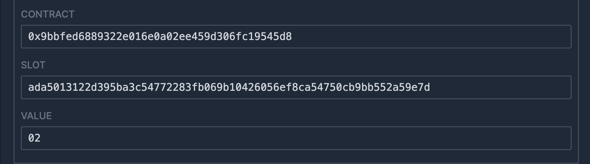
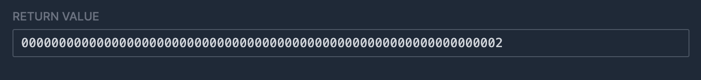
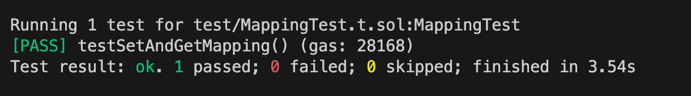

# WTF Huff极简入门: 14. 映射

我最近在重新学Huff，巩固一下细节，也写一个“Huff极简入门”，供小白们使用（编程大佬可以另找教程），每周更新1-3讲。

推特：[@0xAA_Science](https://twitter.com/0xAA_Science)

社区：[Discord](https://discord.gg/5akcruXrsk)｜[微信群](https://docs.google.com/forms/d/e/1FAIpQLSe4KGT8Sh6sJ7hedQRuIYirOoZK_85miz3dw7vA1-YjodgJ-A/viewform?usp=sf_link)｜[官网 wtf.academy](https://wtf.academy)

所有代码和教程开源在github: [github.com/AmazingAng/WTF-Huff](https://github.com/AmazingAng/WTF-Huff)

-----

这一讲，我们介绍如何在Huff中使用映射（`mapping`），包括将其保存到状态变量和在函数中返回。

## 映射

在Solidity合约中，我们经常会用到映射变量。Huff并不原生支持映射类型，但是我们可以根据Solidity的存储布局，在Huff中实现它。

要实现的Solidity合约：

```solidity
// SPDX-License-Identifier: MIT
pragma solidity ^0.8.15;

contract Mapping {
    mapping(uint => uint) map;


    function setMap(uint key, uint value) external{
        map[key] = value;
    }

    function getMap(uint key) external view returns(uint value){
        value = map[key];
    }
}
```

## mapping类型进阶

我们以`mapping(uint => uint)`类型为例，介绍Solidity的`mapping`类型的变量如何在存储中布局的。更多关于存储布局的内容可以参照[Solidity文档](https://docs.soliditylang.org/zh/v0.8.20/internals/layout_in_storage.html)。由于`mapping`类型不会做为`calldata`或`returndata`的内容，所以我们不需要考虑它们。

### 存储布局

`mapping`类型的存储布局与动态数组类似。假设我们开始从存储槽`p`开始存储一个`mapping(uint => uint)`类型的数据`map`，那么slot `p`不直接任何映射的内容。对应于映射键`k`的值位于`keccak256(h(k) . p)`， 其中`.`是连接符，`h`是一个函数，根据键的类型应用于键。

- 对于值类型，函数`h`将与在内存中存储值的相同方式来将值填充为`32`字节。比如`uint8`类型的`1`会被填充为`0000000000000000000000000000000000000000000000000000000000000001`。

- 对于字符串和字节数组，`h(k)`只是未填充的数据。

也就是说，如果一个映射键为`1`，存储槽为`0`，它的值所在的存储槽由`keccak256(00000000000000000000000000000000000000000000000000000000000000010000000000000000000000000000000000000000000000000000000000000000)`的结果给出，也就是slot `0xad3228b676f7d3cd4284a5443f17f1962b36e491b30a40b2405849e597ba5fb5`。

## 在Huff中实现mapping类型

### setMap

下面我们来用Huff实现`setMap()`函数，将`uint`类型的键值对存入状态变量中。它的逻辑就是：

- 从`calldata`中读取键值对的值。
- 计算值所在的存储槽。
- 将值存入到相应的存储槽。

```c
/* 接口 */
#define function setMap(uint256 key, uint256 value) nonpayable returns ()
#define function getMap(uint256 key) view returns (uint256 value)

/* 方法 */
#define macro SET_MAP() = takes (0) returns (0) {
    // 假设我们将mapping保存在slot 0中，键值对为 k-v
    0x24 calldataload   // [v]
    0x04 calldataload   // [k, v]

    0x00 mstore         // [v] memory: [0x00: k]
    0x40 0x00 sha3      // [sha3(k.0), v] memory: [0x00: k]

    sstore              // [] memory: [0x00: k] storage [sha3(k.0): v]

    stop
}
```

下面我们实现`getMap()`函数，它的主要逻辑：
- 从`calldata`中读取键。
- 计算值所在的存储槽。
- 通过`sload`读取键对应的值。
- 将值存入内存，然后通过`return`返回。

```c
#define macro GET_MAP() = takes (0) returns (0) {
    // 假设我们将mapping保存在slot 0中
    0x04 calldataload   // [k]
    0x00 mstore         // [] memory: [0x00: k]
    0x40 0x00 sha3      // [sha3(k.0)] memory: [0x00: k]

    sload               // [v] memory: [0x00: k]

    // 将值存入内存
    0x00 mstore         // [] memory: [0x00: v]

    // 返回值
    0x20 0x00 return
}
```

最后，我们在MAIN宏中通过selector判断要调用哪个函数。

```c
#define macro MAIN() = takes (0) returns (0) {
    // 通过selector判断要调用哪个函数
    0x00 calldataload 0xE0 shr
    dup1 __FUNC_SIG(setMap) eq set_map jumpi
    dup1 __FUNC_SIG(getMap) eq get_map jumpi

    // 如果没有匹配的函数，就revert
    0x00 0x00 revert

    set_map:
        SET_MAP()
    get_map:
        GET_MAP()
}
```

## 分析合约字节码

我们可以使用`huffc`命令获取上面合约的runtime code:

```shell
huffc src/14_Mapping.huff -r
```

打印出的bytecode为：

```
5f3560e01c80636c4668ea1461001e578063025799f01461002d575f5ffd5b6024356004355f5260405f2055005b6004355f5260405f20545f5260205ff3
```

将这段字节码复制到[evm.codes playground](https://www.evm.codes/playground?fork=shanghai)。首先，我们调用`setMap()`函数。将`Calldata`设为`0x6c4668ea00000000000000000000000000000000000000000000000000000000000000010000000000000000000000000000000000000000000000000000000000000002`（调用`setMap`函数，键为`1`，值为`2`）并点击运行。右下角的`Storage`被相应更改，运行成功。



接下来，我们调用`getMap()`函数，读取键对应的值。将`Calldata`设为`0x025799f00000000000000000000000000000000000000000000000000000000000000001`（调用`getMap`函数，查询的键为`1`），并运行。可以看到，右下角的`RETURN VALUE`为`0000000000000000000000000000000000000000000000000000000000000002`，与预期一致，运行成功。



## 使用Foundry测试

我们可以使用Foundry写一个测试，用Solidity来验证咱们写的Huff合约是否能正常工作。

测试合约：

```solidity
// SPDX-License-Identifier: MIT
pragma solidity ^0.8.15;

import "foundry-huff/HuffDeployer.sol";
import "forge-std/Test.sol";
import "forge-std/console.sol";

contract MappingTest is Test {
    /// @dev Address of the I14_Mapping contract.
    I14_Mapping public i14_Mapping;

    /// @dev Setup the testing environment.
    function setUp() public {
        i14_Mapping = I14_Mapping(HuffDeployer.deploy("14_Mapping"));
    }

    /// @dev Ensure that you can set and get the value.
    function testSetAndGetMapping() public {
        uint k = 1;
        uint v = 2;
        i14_Mapping.setMap(k, v);
        assertEq(v, i14_Mapping.getMap(k));
    }
}

interface I14_Mapping {
	function getMap(uint256) external view returns (uint256);
	function setMap(uint256, uint256) external;
}
```

在命令行输入中输入`forge test`运行测试合约，可以看到测试通过！



## 总结

这一讲，我们介绍了如何在Huff中写入并读取`mapping`类型的映射，并在`evm.codes`上成功运行了合约。