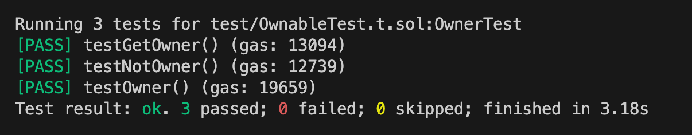

# WTF Huff Minimalist Introduction: 16. Permission Control

I'm re-learning Huff recently, consolidating the details, and writing a "Minimalist Introduction to Huff" for novices (programming experts can find another tutorial). I will update 1-3 lectures every week.

Twitter: [@0xAA_Science](https://twitter.com/0xAA_Science)

Community: [Discord](https://discord.gg/5akcruXrsk)｜[WeChat Group](https://docs.google.com/forms/d/e/1FAIpQLSe4KGT8Sh6sJ7hedQRuIYirOoZK_85miz3dw7vA1-YjodgJ-A/viewform?usp=sf_link) |[Official website wtf.academy](https://wtf.academy)

All codes and tutorials are open source on github: [github.com/AmazingAng/WTF-Huff](https://github.com/AmazingAng/WTF-Huff)

-----

In this lecture, we introduce how to implement a modifier (`modifier`) similar to Solidity in Huff to achieve the function of permission control.

## Permission control

In Solidity, we generally use decorators to implement permission control. For example, a function containing the `onlyOwner` decorator only allows the `owner` of the contract to be called. In this lecture, we will use Huff to implement the following `Ownable` contract:

```solidity
// SPDX-License-Identifier: MIT
pragma solidity ^0.8.4;

contract Ownable {
	address public owner; // define owner variable   
   event OwnerUpdated(address indexed oldOwner, address indexed newOwner);

   constructor() {
      owner = msg.sender;
      emit OwnerUpdated(address(0), owner);
   }

   // define modifier
    modifier onlyOwner {
       require(msg.sender == owner); // Check whether the caller is the owner address
       _; // If yes, continue running the function body; otherwise, report an error and revert the transaction
   }

   //Define a function with onlyOwner modifier
    function changeOwner(address _newOwner) external onlyOwner{
       address oldOwner = owner;
       owner = _newOwner; // Only the owner address runs this function and changes the owner
       emit OwnerUpdated(oldOwner, _newOwner);
   }
}
```

## accomplish

Our implementation contract is simplified from `Owned.huff` in [huffmate](https://github.com/huff-language/huffmate). Its logic is simple:

- In the constructor, we initialize `owner` as the deployer (`caller`) of the contract and save it in the storage slot `OWNER`.
- `ONLY_OWNER` macro: implements the effect of `onlyOwner` modifier. It checks whether `msg.sender` and `owner` are equal: if they are equal, continue to execute the following logic; if you don’t want to wait, roll back the transaction.
- `owner()` macro: Get the `owner` address.
- `changeOwner()` macro: Modify the `owner` address. It uses the `ONLY_OWNER` macro for permission control, and only the `owner` can call it.

```c
// Adapted from <https://github.com/huff-language/huffmate/blob/main/src/auth/Owned.huff>

/* method */
#define function changeOwner(address) nonpayable returns ()
#define function owner() view returns (address)

/* interface */
#define event OwnerUpdated(address indexed user, address indexed newOwner)

/* storage slot */
#define constant OWNER = FREE_STORAGE_POINTER()

/* Constructor */
#define macro CONSTRUCTOR() = takes (0) returns (0) {
    // During initialization, set the deployer as owner
    caller                      // [caller]
    dup1                        // [caller, caller]
    [OWNER]                     // [OWNER, caller, caller]
    sstore                      // [caller]

    // Release the OwnerUpdated event
    0x00                      // [0, caller]
    __EVENT_HASH(OwnerUpdated)  // [sig, 0, caller]
    0x00 0x00                   // [0, 0, sig, 0, caller]
    log3                        // []
}

// OnlyOwner modifier
#define macro ONLY_OWNER() = takes (0) returns (0) {
     // Compare caller and Owner, if they are different, revert; if they are the same, jump to auth and continue the next logic
     caller // [msg.sender]
     [OWNER] sload // [owner, msg.sender]
     eq authed jumpi // [authed]

     // If it is not the owner, just revert
     0x00 0x00 revert

    authed:
}

//Modify Owner
#define macro CHANGE_OWNER() = takes (0) returns (0) {
   //Only owner can call
   ONLY_OWNER()

   // Set new owner
   0x04 calldataload // [newOwner]
   dup1 // [newOwner, newOwner]
   [OWNER] sstore // [newOwner]

   // Release the OwnerUpdated event
   caller // [from, newOwner]
   __EVENT_HASH(OwnerUpdated) // [sig, from, newOwner]
   0x00 0x00 // [0, 32, sig, from, newOwner]
   log3 // []

  stop
}

//Read owner address
#define macro OWNER() = takes (0) returns (0) {
     [OWNER] sload // [owner]
     0x00 mstore // []
     0x20 0x00 return
}

//The main entrance of the contract, determine which function is called
#define macro MAIN() = takes (0) returns (0) {
     // Determine which function to call through selector
     0x00 calldataload 0xE0 shr
     dup1 __FUNC_SIG(changeOwner) eq change_owner jumpi
     dup1 __FUNC_SIG(owner) eq owner jumpi
     // If there is no matching function, revert
     0x00 0x00 revert

    change_owner:
        CHANGE_OWNER()
    owner:
        OWNER()
}
```

## Test using Foundry

We can use Foundry to write a test and use Solidity to verify whether the Huff contract we wrote can work properly. We wrote three unit tests

1. `testGetOwner`: Test whether the address obtained by the `owner()` function is equal to `owner`.
2. `testNotOwner`: Test whether the `changeOwner()` function will be rolled back when called from a non-`owner` address.
3. `testOwner`: Test whether the `owner` can be modified when the `owner` address calls the `changeOwner()` function.

Note that since Foundry-huff uses the `HuffDeployer` and `HuffConfig` contracts to indirectly deploy the Huff contract, we have no control over the `caller` of the constructor. We used a compromise. In `setUp()`, we recorded the `owner` address after the contract was deployed to facilitate subsequent testing.

Test contract:

```solidity
// SPDX-License-Identifier: Unlicense
pragma solidity ^0.8.15;

import "foundry-huff/HuffDeployer.sol";
import "forge-std/Test.sol";
import "forge-std/console.sol";

contract OwnerTest is Test {
    /// @dev Address of the I16_Ownable contract.
    I16_Ownable public i16_Ownable;
    address owner;
    address alice = address(1);

    /// @dev Setup the testing environment.
    function setUp() public {
        i16_Ownable = I16_Ownable(HuffDeployer.deploy("16_Ownable"));
        owner = i16_Ownable.owner();
    }

    /// @dev Test when caller is not owner
    function testGetOwner() public {
        console.log(i16_Ownable.owner());
        assertEq(owner, i16_Ownable.owner());
    }

    /// @dev Test when caller is not owner
    function testNotOwner() public {
        vm.expectRevert();
        vm.prank(alice);
        i16_Ownable.changeOwner(alice);
    }

    /// @dev Test when caller is not owner
    function testOwner() public {
        vm.prank(owner);
        i16_Ownable.changeOwner(alice);
        assertEq(alice, i16_Ownable.owner());
    }


}

interface I16_Ownable {
	event OwnerUpdated(address indexed, address indexed);
	function changeOwner(address) external;
	function owner() external view returns (address);
}
```

Enter `forge test` in the command line input to run the test contract, and you can see that the test passes!




## Summary

In this lecture, we implemented a Solidity-like decorator function in Huff for permission control.
